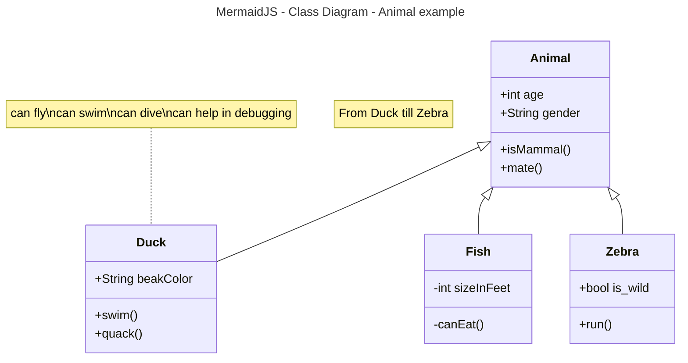

# Activity 1 


- This is activity 1...

## fruits

- Apples
     - Red
     - Yellow
     - Green
- Oranges
- Item 3
    - Indented Item 1
    - Indented Item 2
    - Indented Item 3
- Item 

## Links / Images

- [wikiBob](https://gitlab.com/bobby.estey/wikibob/-/blob/master/README.md)
- [Grand Canyon University](https://www.gcu.edu/)


## Tables
|First name|Last name|
|--|--|
|Yonas|Habte|
|Bobby|Estey|

## Code Blocks

```java
// Java Example
public class CodeBlock {
    public static void main(String[] args) {
        System.out.println("Code Block Example");
    }
}
```

## Details - Code Block - MermaidJS - Class Diagram

<details>

