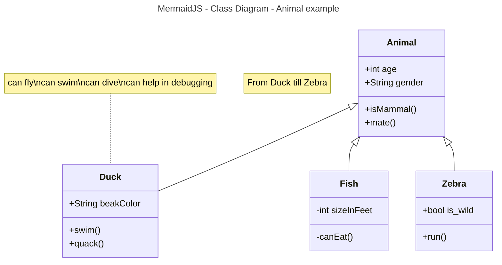

# Markdown - Quick Examples

<!-- this is a comment -->

# Heading 1
## Heading 2
### Heading 3
#### Heading 4
##### Heading 5
###### Heading 6

---
## Formatting
- Example of **Bold Text**
- Example of *Italic Text*
- Example of ***Bold Italic Text***
- Example of ~~Strikethrough~~
- Example of <mark>Highlight</mark>
- Example of Subscript H<sub>2</sub>O
- Example of Superscript X<sup>2</sup>
> blockquote
> more blockquotes

---
## Ordered List
1. Item 1
2. Item 2
3. Item 3
   1. Indented Item 1
   2. Indented Item 2
   3. Indented Item 3
4. Item 4

---
## Unordered List

>>>
- Item 1
- Item 2
- Item 3
    - Indented Item 1
    - Indented Item 2
    - Indented Item 3
- Item 
>>>

---
## Links / Images

- [wikiBob](https://gitlab.com/bobby.estey/wikibob/-/blob/master/README.md)
- [Grand Canyon University](https://www.gcu.edu/)


---
## Tables
|Column1|Column2|Column3|
|--|--|--|
|Row1Column1|Row1Column2|Row1Column3|
|Row2Column1|Row2Column2|Row2Column3|
|USS Constellation<br>CVA/CV64<br>America's Flagship|||

---
## Code Blocks

```java
// Java Example
public class CodeBlock {
    public static void main(String[] args) {
        System.out.println("Code Block Example");
    }
}
```

```bash
# bash example
- git clone URL - Copy from the repository all contents to the local machine
- git status - Get the Status between the local machine and the repository
- git add file(s)- git add . - Add files to the repository- git add . means add all files
- git reset file(s) - Remove recently added files
- git commit -m "text message" - Prepare the files to send to the repository and provide a message about the commit
- git push - Push up from the local machine to the repository
- git pull - Pull down from the repository to the local machine
```

## Details - Code Block - MermaidJS - Class Diagram

<details>



</details>

---
## Task Lists
- [x] Task 1 - completed
- [ ] Task 2 - not completed
- [ ] Task 3 - not completed
- [x] Task 4 - completed

---
## Foot Notes
Here's a sentence with a footnote. [^1]

[^1]: This is the footnote.

---
## Term / Definition

term
: definition

---
## Emoji
[Emoji Cheatsheet](https://github.com/ikatyang/emoji-cheat-sheet)

Cheers! :beers:

---

## Details - Alerts

<details>

## Alerts

> [!NOTE]
> Alert Note

> [!TIP]
> Alert Tip

> [!IMPORTANT]  
> Alert Important

> [!WARNING]  
> Alert Warning

> [!CAUTION]
> Alert Caution
>
</details>

## Additional Tricks

#### Add a Blank line in a list, put 2 spaces at the end of the line, e.g. Bananas and Green have two spaces at the end

1.  Apples
2.  Bananas  

     1.  Red
     2.  Yellow
     3.  Green  
     
3.  Oranges
